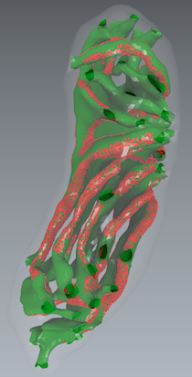

  

# Mitochondrial morphology provides a mechanism for energy buffering at synapses
[DOI:10.1038/s41598-019-54159-1](https://doi.org/10.1038/s41598-019-54159-1)

Welcome to the repository of the mitochondrial morphology project! This repository contains all the final code used for this publication, for the simulations and images in the paper. Other material as the electron tomogram used to generate the meshes, and the meshes themselves can be found [here](https://r3lab.uni.lu/frozen/mitochondrial-morphology-provides-a-mechanism-for-energy-buffering-at-synapses).

## Folders

For this publication we performed four computational experiments. In the folder `mcell`  you can find the code for the spatial MCell simulations, each experiment has its own directory. The names of the experiments are the same as in the publication. Three different spatial configurations of the proteins were explore they corresponds to the directories cristae, ibm and both. In the folder  `odes_and_figures` is the code use to run the space-independent ordinary differential equation (ODE) approach, as before each experiment has its own directory. These scripts are written in python 3. Depending on the code you want to run the software required, please refer to the section Installation for details.

## Installation
Spatiotemporal simulations were performed with [MCell](https://mcell.org/) (version 3.4). The corresponding ODEs were integrated with [PyDSTool version 0.88](https://pydstool.github.io/PyDSTool/FrontPage.html), and the following python libraries were also use for analysis and to produce the figures: [numpy 1.18.1](https://numpy.org/) and [matplotlib 3.2.0](https://matplotlib.org/).

## License

All creative works (writing, figures, etc) are licensed under the [Creative
Commons CC-BY 4.0](https://creativecommons.org/licenses/by/4.0/) license. All software is distributed under the standard MIT license as follows
